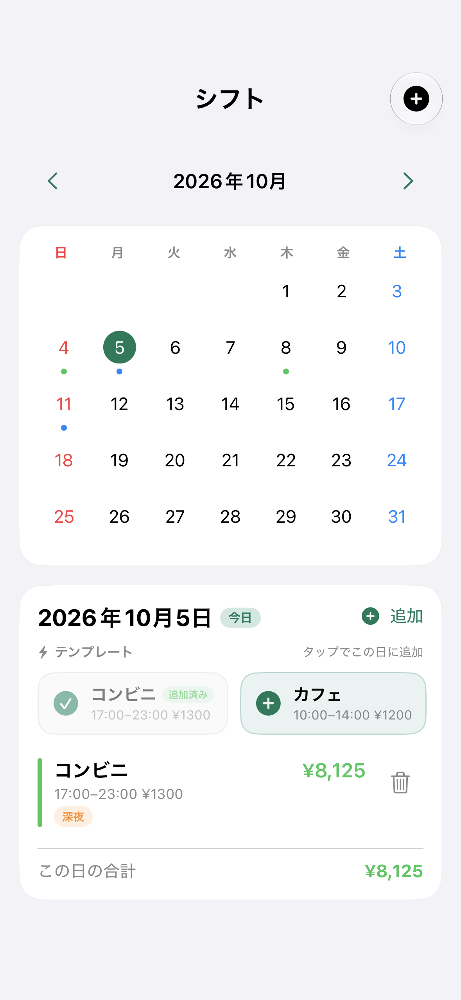

# Shift Builder

掛け持ちで働く学生・フリーター向けに、シフト・給与見込み・支出をまとめて管理するiOSアプリです。SwiftUIで画面を実装し、給与計算を独立したSwiftパッケージに分け、クラウド同期、StoreKit 2の課金、端末内OCRによるシフト取り込みまで開発しました。

**開発実績としてソースを公開しています。App Store未公開。収益化の検証は保留しています。**

## 画面

<table>
<tr><th>シフト管理</th><th>給料日を使った残高予測</th><th>写真からのシフト取り込み</th></tr>
<tr>
<td></td>
<td></td>
<td></td>
</tr>
</table>

画像は実装済みの画面をシミュレータで撮影したものです。勤務先・勤務・金額は架空のサンプルデータです。

## 実装した機能

- 複数勤務先のシフト、繰り返し勤務、テンプレート、通知。
- 時給、深夜・時間外・休日の割増、休憩、締め日・給料日を使った給与見込みと支給実績の記録。
- 支出・定期支出と、給料日の入金を使った残高予測。無料7日／Plus 90日の機能分岐。
- シフトを1回増減した場合の給与比較。
- Apple Visionによる端末内OCR。候補の修正・確認後に一括登録し、同じシフトの二重登録を防止。
- Firebase AuthenticationとFirestoreを使ったアカウント単位の同期、オフライン編集、競合表示、アカウント削除。
- StoreKit 2の商品取得、検証済みの購入による利用権、復元、承認待ち、期限切れ・返金への対応。
- Firebaseに接続しないローカル保存のデモ用構成。ローカルStoreKit設定で購入処理を試せます。

写真取り込みは、**1行に日付と1組の勤務時間がある個人用一覧**に対応しています。全員の横長表、本人の行の自動選択、早番・遅番などの勤務記号、変更差分の自動反映は未対応です。読み取り結果は原本と確認する必要があります。

## 技術構成

| 領域 | 技術・設計 |
| --- | --- |
| UI | SwiftUI、Swift Charts、PhotosPicker、日本語・英語、ダークモード |
| 給与・予測 | Foundationベースの独立したSwiftパッケージ `PayrollEngine` |
| OCR | Apple Vision。画像とOCR文字列を外部AIにアップロードしない |
| 同期・認証 | Firebase Auth、Firestore、Google Sign-In、Sign in with Apple |
| 課金 | StoreKit 2、StoreKit Testing、検証済みトランザクションから利用権を判断 |
| 検証 | XCTest、Swift Packageの単体テスト、Firestore Emulator用テスト |

設計は [docs/ARCHITECTURE.md](docs/ARCHITECTURE.md)、確認範囲は [docs/VALIDATION.md](docs/VALIDATION.md) にまとめています。

## ローカルデモを動かす

開発時の検証環境はXcode 27／iOS 27シミュレータです。プロジェクトの対象OSはiOS 17以降です。外部依存はSwift Package Managerで取得します。

```sh
git clone https://github.com/ichiha4/shift-ledger.git
cd shift-ledger
python3 scripts/setup_local_demo.py
open ShiftManagerApp/ShiftManagerApp.xcodeproj
```

1. Schemeを **ShiftManagerApp-LocalDevice** に設定します。
2. 実行先にiPhoneシミュレータを選び、Runします。
3. この構成ではログイン不要で、データはローカルに保存します。勤務先を登録してからシフトを入力するか、写真取り込みの「サンプル画像で試す」を使います。
4. Plusを試す場合は、RunのStoreKit Configurationが `ShiftBuilderPlus.storekit` であることを確認します。共有Schemeに設定済みです。これはローカルの購入テストで、実際の請求はありません。

セットアップスクリプトは、Xcodeのリソース参照を満たすためのダミー設定を生成します。既存のFirebase設定は上書きしません。**ダミー設定で通常Schemeの認証・クラウド同期は利用できません。**

自分のiPhoneで動かす場合は、Bundle IDを自分用に変更し、LocalDevice構成にPersonal Teamを設定してください。[詳細なセットアップ](docs/SETUP.md)

## テスト

給与計算パッケージはFirebaseやiPhoneなしでテストできます。

```sh
cd PayrollEngine
swift test --jobs 1
```

iOS側は `ShiftManagerApp-LocalDevice` のTestでローカル保存・課金・同期ロジック・OCRを確認できます。Firestore実接続テストは専用エミュレータを起動したときだけ実行する設計です。

開発時の確認結果は、給与計算パッケージ139件成功、iOS側38件成功・Firestore Emulator向け4件スキップです。これらは公開用の設定を置き換える前の実行結果で、公開用コピーに対する全テストの再実行結果ではありません。

## プロジェクトの判断

主対象をバイト学生・フリーターに絞り、基本無料と月額Plusを検討しました。しかし、無料のシフト・給与管理や写真取り込みの競合があり、このアプリに支払う理由と継続利用はまだ確認できていません。

追加開発を進める前に市場価値を再評価し、収益化を保留して、実装と検証の成果を公開する方針にしました。購入者・売上・利用者数の実績はありません。[市場調査と判断](docs/PRODUCT_DECISION.md)

本番Firebase設定、署名用のTeam ID、実端末の識別子、認証情報、ビルド成果物、バックアップは公開対象に含めていません。App Store Connect、Sandbox／TestFlight、実機での一連の確認は未完了です。
