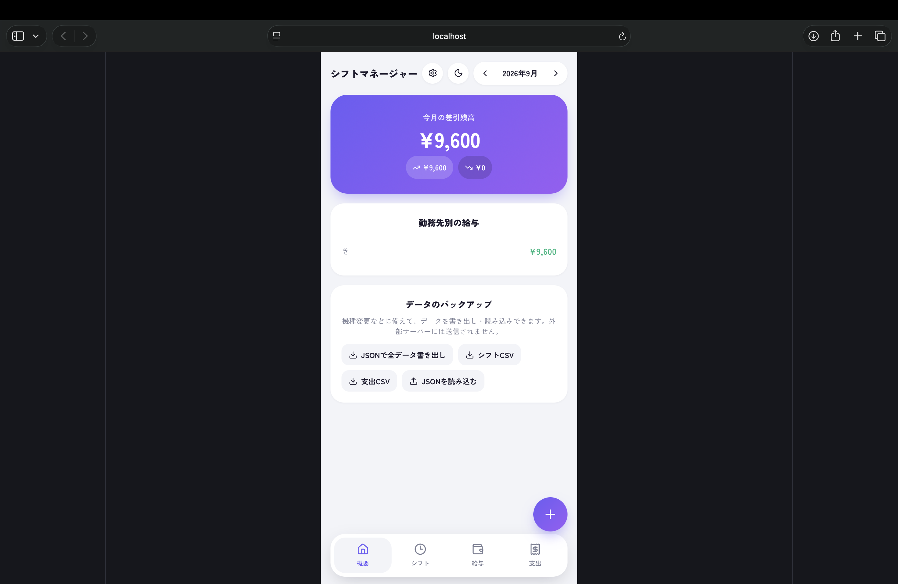

# シフトマネージャー

アルバイトのシフト管理と給与計算を行うWebアプリです。深夜・時間外・休日の割増賃金を自動で計算し、締め日に基づいた支給予定額を算出します。

## 主な機能

- **割増賃金の自動計算** — 深夜(22時〜翌5時)25%、時間外25%、休日35%を分単位で判定
- **週40時間の判定** — 週をまたぐ勤務も正しく集計し、時間外の対象を自動判別
- **締め日・支払日の管理** — 勤務先ごとに締め日を設定し、実際に振り込まれる月を算出
- **給与明細との照合** — 実際の支給額を入力し、計算値との差額を確認
- **複数勤務先に対応** — 掛け持ちでも勤務先ごとに時給・締め日を個別管理
- **支出管理** — カテゴリ別の支出を記録し、収支を一覧表示
- **データの書き出し・読み込み** — JSON / CSV に対応。外部サーバーには送信しません
- **ダークモード**

## 技術構成

- React 19
- Vite
- lucide-react
- データはブラウザのlocalStorageに保存

## 開発環境での起動

    npm install
    npm run dev

## ライセンス

MIT
