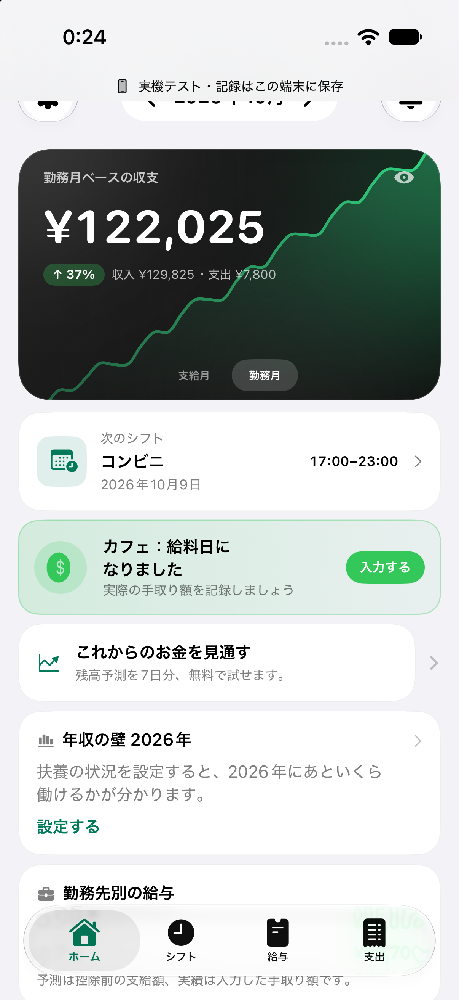
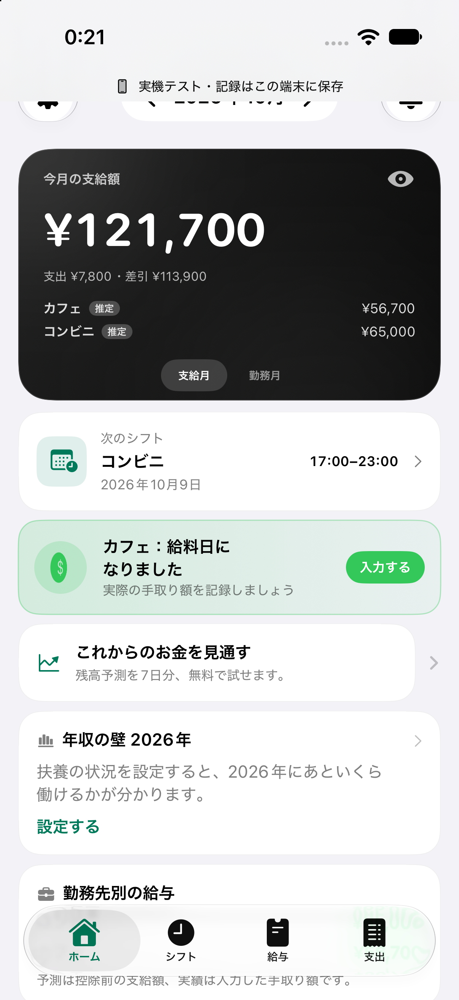
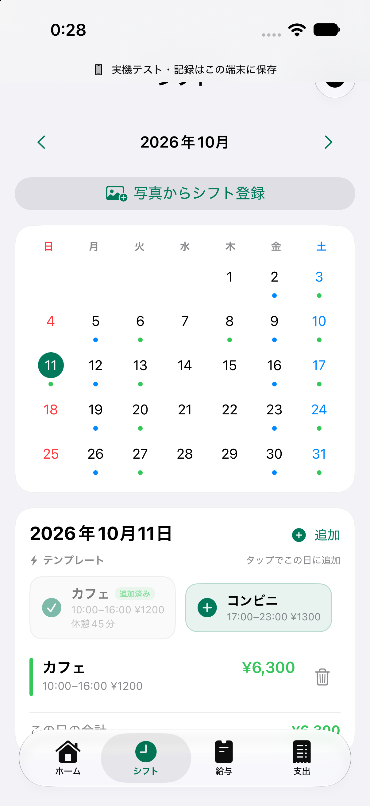
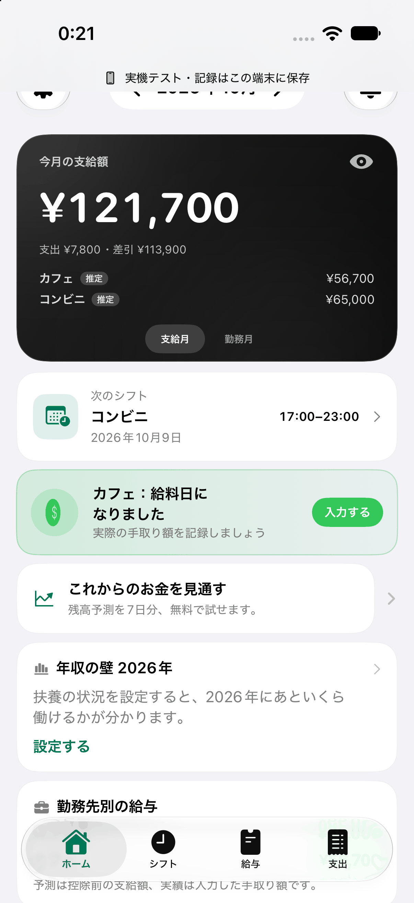
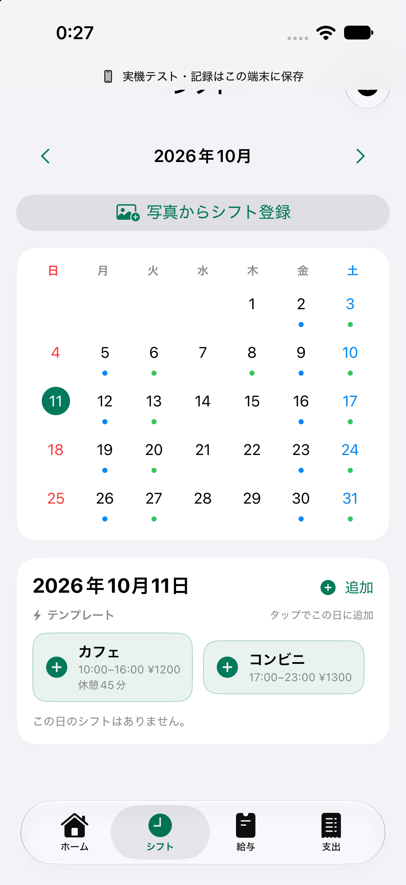
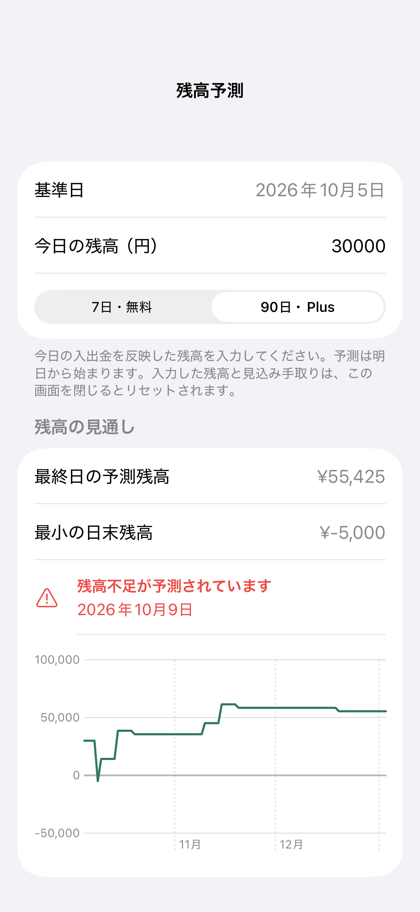
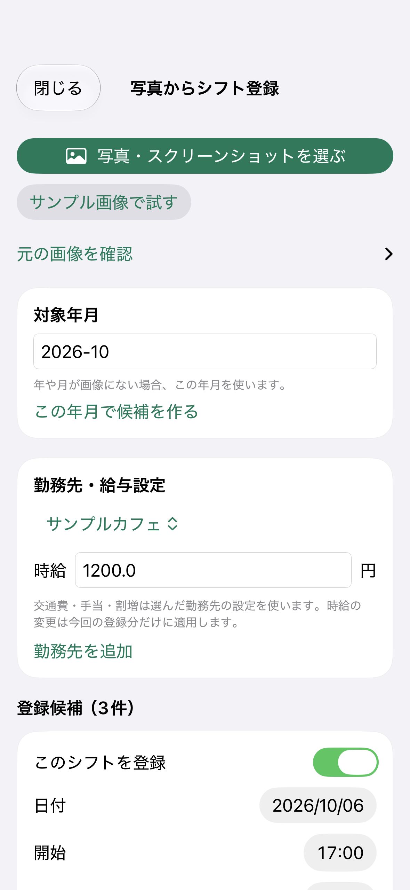

# Shift Builder

**シフトをサッと入れて、給料日を楽しみに。**

アルバイトをする学生・フリーターのための、シフトと給与を確認するiOSアプリです。見返したくなるホーム、給料日のアニメーション、テンプレートからのワンタップ追加で、記録の負担を減らし、働いた成果を気持ちよく確認できる体験を目指しています。掛け持ちの勤務先もまとめて管理できます。

## 使い続けたくなる3つの工夫

<table>
<tr><th>見返したくなるホーム</th><th>給料日を楽しむ動き</th><th>テンプレートからワンタップ</th></tr>
<tr>
<td></td>
<td></td>
<td></td>
</tr>
</table>

### 1. ホームを開くと、自分の稼ぎが見える

黒を基調にしたカードに、今月の支給額と勤務先ごとの内訳を大きく表示。カードを切り替えると、勤務月ベースの収支とグラフも確認できます。金額を隠すボタンや、次のシフトへの導線も用意しました。働いた成果を見返したくなる、見た目と情報のまとまりを大切にしています。

### 2. 給料日には、動きのあるバナーで知らせる

給料日になると、コインが回転するバナーが現れます。「入力する」から実際の手取り額を記録し、ホームの表示に反映できます。給料日を楽しむ演出と、記録するタイミングをつなげています。



### 3. 日付を選んで、いつものシフトをワンタップ

登録した勤務パターンをテンプレートとして再利用。追加したい日を選び、勤務先のテンプレートをタップすると、勤務時間・時給・休憩などを引き継いで追加できます。毎回フォームを埋める手間を減らします。追加済みのパターンはチェック表示になり、同じ日の二重追加を防ぎます。



画面とGIFは実装済みのSwiftUIアプリをシミュレータで撮影したものです。上の3つはローカルデモ構成を使用し、勤務先・勤務・金額はすべて架空のサンプルデータです。テンプレートのGIFは1回のタップ前後を交互に表示しています。

設計の意図は [UI・UXの設計](docs/DESIGN.md) にまとめています。

## ほかにできること

- 複数勤務先のシフトをカレンダーに集約。繰り返し勤務と勤務前の通知にも対応。
- 時給・休憩・深夜や残業の割増・締め日・給料日を使った給与見込みと、支給実績の記録。
- 支出・定期支出と給料日の入金を使った残高予測。無料7日／Plus 90日の機能分岐。
- 元の予定を変えずに、シフトを1回増減した場合の給与を比較。
- 写真からシフト候補を読み取り、確認・修正して一括登録。Apple Visionで端末内処理。
- アカウントごとのクラウド同期、オフライン編集、同期の競合表示。

<details>
<summary>残高予測・写真取り込みの画面</summary>

<table>
<tr><th>残高予測</th><th>写真からのシフト取り込み</th></tr>
<tr>
<td></td>
<td></td>
</tr>
</table>

給与・残高の予測は入力に基づく概算です。銀行口座との自動連携はありません。写真取り込みは、1行に日付と1組の勤務時間がある個人用一覧に対応しています。全員の横長表や早番・遅番などの勤務記号は未対応で、読み取り結果を原本と確認する必要があります。

</details>

## 技術構成

| 領域 | 技術・設計 |
| --- | --- |
| UI | SwiftUI、Swift Charts、PhotosPicker、日本語・英語、ダークモード |
| 給与・予測 | Foundationベースの独立したSwiftパッケージ `PayrollEngine` |
| OCR | Apple Vision。画像とOCR文字列を外部AIにアップロードしない |
| 同期・認証 | Firebase Auth、Firestore、Google Sign-In、Sign in with Apple |
| 課金 | StoreKit 2、StoreKit Testing、検証済みトランザクションから利用権を判断 |
| 検証 | XCTest、Swift Packageの単体テスト、Firestore Emulator用テスト |

設計は [docs/ARCHITECTURE.md](docs/ARCHITECTURE.md)、確認範囲は [docs/VALIDATION.md](docs/VALIDATION.md) にまとめています。

## ローカルデモを動かす

開発時の検証環境はXcode 27／iOS 27シミュレータです。プロジェクトの対象OSはiOS 17以降です。外部依存はSwift Package Managerで取得します。

```sh
git clone https://github.com/ichiha4/shift-ledger.git
cd shift-ledger
python3 scripts/setup_local_demo.py
open ShiftManagerApp/ShiftManagerApp.xcodeproj
```

1. Schemeを **ShiftManagerApp-LocalDevice** に設定します。
2. 実行先にiPhoneシミュレータを選び、Runします。
3. この構成ではログイン不要で、データはローカルに保存します。勤務先を登録してからシフトを入力するか、写真取り込みの「サンプル画像で試す」を使います。
4. Plusを試す場合は、RunのStoreKit Configurationが `ShiftBuilderPlus.storekit` であることを確認します。共有Schemeに設定済みです。これはローカルの購入テストで、実際の請求はありません。

セットアップスクリプトは、Xcodeのリソース参照を満たすためのダミー設定を生成します。既存のFirebase設定は上書きしません。**ダミー設定で通常Schemeの認証・クラウド同期は利用できません。**

自分のiPhoneで動かす場合は、Bundle IDを自分用に変更し、LocalDevice構成にPersonal Teamを設定してください。[詳細なセットアップ](docs/SETUP.md)

## テスト

給与計算パッケージはFirebaseやiPhoneなしでテストできます。

```sh
cd PayrollEngine
swift test --jobs 1
```

iOS側は `ShiftManagerApp-LocalDevice` のTestでローカル保存・課金・同期ロジック・OCRを確認できます。Firestore実接続テストは専用エミュレータを起動したときだけ実行する設計です。

開発時の確認結果は、給与計算パッケージ139件成功、iOS側38件成功・Firestore Emulator向け4件スキップです。これらは公開用の設定を置き換える前の実行結果で、公開用コピーに対する全テストの再実行結果ではありません。

## 開発・公開の状況

App Store公開に向けて、UI・UXの試用確認を準備しています。**現在はApp Store未公開です。** 基本無料と月額Plusを検討していますが、料金は未確定です。

次に確かめるのは、ホームの見た目、給料日の動き、入力の手軽さが、実際に使い続ける理由になるかです。利用者の試用・有料購入・継続利用はまだ確認していません。[製品の方針と市場調査](docs/PRODUCT_DECISION.md)

本番Firebase設定、署名用のTeam ID、実端末の識別子、認証情報、ビルド成果物、バックアップは公開対象に含めていません。App Store Connect、Sandbox／TestFlight、実機での一連の確認は未完了です。
